# ANN Course Mind Map

This map links each topic to:

- the day where it appears;
- the PDF, notebook, or file where it is found;
- the syllabus part it covers.

## Syllabus Coverage Legend

| Code | Syllabus part covered |
|---|---|
| T1 | Introduction to neural networks |
| T2 | The ANN: perceptron, layers, weights, biases, hyperparameters |
| T3 | Activation and cost functions |
| T4 | Optimization algorithms |
| T5 | Backpropagation |
| T6 | The learning mechanism |
| T7 | Classification and regression |
| P1 | Introduction to PyTorch 2.0 |
| P2 | Neural network training and evaluation using PyTorch and TensorBoard |
| P3 | Hyperparameter tuning using Optuna |
| P4 | Real-life case-study regression and classification examples |
| S | Supplemental / reference content beyond the core day-by-day syllabus |

## Visual Mind Map

```mermaid
mindmap
  root((Artificial Neural Networks Course))
    Syllabus["ANN Syllabus.pdf"]
      Theory["Theoretical Part"]
        T1["T1: Introduction to neural networks"]
        T2["T2: ANN components"]
        T3["T3: Activations and losses"]
        T4["T4: Optimization algorithms"]
        T5["T5: Backpropagation"]
        T6["T6: Learning mechanism"]
        T7["T7: Classification and regression"]
      Practice["Practical Part"]
        P1["P1: PyTorch 2.0"]
        P2["P2: Training, evaluation, TensorBoard"]
        P3["P3: Optuna tuning"]
        P4["P4: Regression and classification case studies"]
    Day_1["Day 1"]
      D1_AI["ANN_01_introduction_to_artificial_intelligence.pdf"]
        AI_scope["AI, ML, deep learning [T1]"]
        DL_apps["Deep learning applications [T1]"]
        ML_workflow["ML workflow: problem, data, training, evaluation, deployment [T6]"]
      D1_NN["ANN_02_understanding_neural_networks.pdf"]
        NN_definition["What neural networks are [T1]"]
        History["History: perceptron to deep learning [T1, T2]"]
        Neuron["Artificial neuron, perceptron, weights, biases [T2]"]
        Layers["Layers, depth, shallow vs deep, MLP [T2]"]
        Nonlinearity["Why activations create non-linearity [T3]"]
        Activations["Linear, binary step, sigmoid, tanh, ReLU, Leaky ReLU, PReLU, Swish, Softmax [T3]"]
        Outputs["Regression, binary, multiclass, multilabel outputs [T7]"]
      D1_Practical["ANN_00_practical.pdf"]
        PyTorch_intro["PyTorch framework, tensors, modules [P1]"]
        PyTorch_tools["Explicit code, flexibility, community, deployment [P1]"]
      D1_Lab["ann_lab_01_pytorch_fundamentals.ipynb"]
        Tensor_basics["Tensors, dtypes, devices, shapes [P1]"]
        Tensor_ops["Indexing, reshape, squeeze, unsqueeze, matrix multiplication [P1]"]
        Numpy_bridge["PyTorch and NumPy conversion [P1]"]
    Day_2["Day 2"]
      D2_Learn["ANN_03_How_neural_networks_learn.pdf"]
        Preprocessing["Numerical inputs, categorical encoding, normalization [T6, T7]"]
        Training_cycle["Data loading, forward pass, loss, backprop, update [T6]"]
        Losses["MSE, BCE, categorical cross entropy, multilabel loss [T3, T7]"]
        Gradient_descent["Gradient descent and learning rate [T4, T6]"]
        Backprop["Chain rule and backpropagation [T5]"]
        Gradients["Vanishing gradients, dying ReLU [T3, T5]"]
        Feeding["Batch GD, SGD, mini-batch GD [T4]"]
        Optimizers["Momentum, AdaGrad, RMSProp, Adam [T4]"]
      D2_Lab_Churn["ann_lab_02_binary_classification_pytorch.ipynb"]
        Churn_data["Bank churn data loading and preprocessing [P4]"]
        Encoding["Ordinal encoding, one-hot encoding, scaling [P4, T6]"]
        Binary_model["Binary classifier with BCEWithLogitsLoss and Adam [P2, T7]"]
        TensorBoard["Training curves with SummaryWriter/TensorBoard [P2]"]
        Evaluation["Confusion matrix, classification report, save/load model [P2]"]
      D2_Lab_Cancer["ann_lab_02_cancer_binary_classification_pyTorch.ipynb"]
        Cancer_case["Breast cancer binary classification case study [P4]"]
        Cancer_training["Dataset/DataLoader, model, training, evaluation [P2]"]
    Day_3["Day 3"]
      D3_Eval["ANN_04_Model_evaluation_and_improvement.pdf"]
        Objective["Learning objective: minimize loss on training examples [T6]"]
        Splitting["Train, validation, test split; stratification; gold rules [T6]"]
        Underfit["Underfitting: high train and validation error [T6]"]
        Overfit["Overfitting: low train error, high validation error [T6]"]
        Bias_variance["Bias-variance trade-off [T6]"]
        Mitigation["More complexity, more epochs, more data, feature selection, regularization [T6]"]
        Hyperparameters["Learning rate, epochs, batch size, architecture, regularization [T2]"]
        Tuning["Grid search, random search, Bayesian optimization, K-fold CV [P3]"]
        Regularization["L1, L2, dropout, early stopping, data augmentation, batch norm [T6]"]
        Deep_learning["Why deep learning, why deeper, drawbacks, training challenges [T1, T6]"]
      D3_Lab_Regression["ann_lab_03_housing_regression_pytorch.ipynb"]
        Housing["California housing regression [P4, T7]"]
        Regression_training["MSELoss, ReLU MLP, TensorBoard, test evaluation, save/load [P2]"]
      D3_Lab_Shortcut["ann_lab_02_cancer_bc_shortcut.ipynb"]
        Shortcut["Compact breast cancer binary-classification pipeline [P2, P4]"]
    Day_4["Day 4"]
      D4_Curves["ANN_exercise_curves.pdf"]
        Curve_reading["Diagnose underfitting vs overfitting from curves [T6]"]
        Fixes["Choose fixes from train/validation loss behavior [T6]"]
        Gradient_shapes["Identify gradients from functions [T3, T5]"]
      D4_Activation_Txt["Activation_Functions.ipynb.txt"]
        Activation_compare["Gradient flow through activation functions [T3, T5]"]
        Saturation["Sigmoid/tanh saturation and vanishing gradients [T3, T5]"]
        Relu_family["ReLU-based networks and dead-neuron behavior [T3]"]
      D4_Optimization_Txt["Optimization_and_Initialization.ipynb.txt"]
        Init_need["Stable gradient flow, vanishing/exploding gradients [T5, T6]"]
        Xavier["Xavier/Glorot initialization [T6]"]
        Kaiming["Kaiming/He initialization for ReLU networks [T6]"]
        Optim_compare["SGD, SGD with momentum, Adam [T4]"]
      D4_Lab_Cancer_Reg["ann_lab_04_cancer_tuning_regularization_pytorch.ipynb"]
        Cancer_regularization["Batch norm, dropout, L2, combined regularization [P2, T6]"]
        Cancer_optuna["Optuna hyperparameter tuning [P3]"]
      D4_Lab_MNIST["ann_lab_05_MNIST_tuning_regularization_pytorch.ipynb"]
        MNIST["MNIST multiclass classification [P4, T7]"]
        MNIST_arch["Flatten, Linear, ReLU, Dropout, CrossEntropyLoss [P2, T7]"]
        MNIST_tuning["Optuna, best-parameter retraining, misclassified examples [P3, P2]"]
    Supplemental["Supplemental and correction files"]
      AIMA["AI_Russell_Norvig.pdf"]
        AIMA_ref["General AI reference textbook [S, T1]"]
      TF["ANN_practical.pdf"]
        TensorFlow["TensorFlow 2 and Keras introduction [S]"]
      MNIST_corr["ann_mnist_correction.pdf"]
        MNIST_solution["MNIST corrected exercise, scanned/no extractable text [S, P4]"]
      Churn_corr["bank_churn_classification_corrected.pdf"]
        Churn_solution["Bank churn corrected exercise, scanned/no extractable text [S, P4]"]
      Rest["rest.pdf"]
        Rest_unknown["Supplemental PDF, no extractable text in inventory [S]"]
```

## Detailed Source Map

| Day / unit | File | Topics found | Syllabus coverage |
|---|---|---|---|
| Syllabus | `ANN Syllabus.pdf` | Course summary, theory/practice split, course objectives | T1-T7, P1-P4 |
| Day 1 | `day1/ANN_01_introduction_to_artificial_intelligence.pdf` | AI vs ML vs deep learning, examples of deep learning, examples of ML/non-ML AI, machine learning workflow | T1, T6 |
| Day 1 | `day1/ANN_02_understanding_neural_networks.pdf` | ANN definition, history, artificial neuron, perceptron, layers, shallow/deep networks, MLP, weights/biases, activation functions, output types | T1, T2, T3, T7 |
| Day 1 | `day1/ANN_00_practical.pdf` | PyTorch introduction, framework purpose, tensors/modules/training support | P1 |
| Day 1 lab | `day1/ann_lab_01_pytorch_fundamentals.ipynb` | Tensor creation, random/zero/one tensors, dtypes, device info, matrix multiplication, shape errors, aggregation, reshape/stack/squeeze/unsqueeze, indexing, NumPy bridge | P1 |
| Day 2 | `day2/ANN_03_How_neural_networks_learn.pdf` | Data preprocessing, categorical encoding, normalization, training cycle, loss functions, gradient descent, backpropagation, vanishing gradients, batch/SGD/mini-batch, momentum, AdaGrad, RMSProp, Adam | T3, T4, T5, T6, T7 |
| Day 2 lab | `day2/ann_lab_02_binary_classification_pytorch.ipynb` | Bank churn classification, data encoding, splitting, scaling, `TensorDataset`, `DataLoader`, model building, `BCEWithLogitsLoss`, Adam, TensorBoard, evaluation, save/load | P2, P4 |
| Day 2 lab duplicate | `day2/ann_lab_02_binary_classification_pytorch (1).ipynb` | Duplicate/alternate copy of the bank churn binary-classification lab | P2, P4 |
| Day 2 lab | `day2/ann_lab_02_cancer_binary_classification_pyTorch.ipynb` | Breast cancer binary classification, preprocessing, training loop, TensorBoard, evaluation, save/load | P2, P4 |
| Day 3 | `day3/ANN_04_Model_evaluation_and_improvement.pdf` | Learning/evaluation/testing, data split, stratification, underfitting, overfitting, bias-variance trade-off, mitigation, hyperparameters, tuning, K-fold CV, L1/L2, dropout, early stopping, data augmentation, batch norm, deep learning pros/cons | T1, T2, T6, P3 |
| Day 3 lab | `day3/ann_lab_03_housing_regression_pytorch.ipynb` | California housing regression, dataset/dataloader, MLP, `MSELoss`, TensorBoard, evaluation, save/load | T7, P2, P4 |
| Day 3 lab | `day3/ann_lab_02_cancer_bc_shortcut.ipynb` | Compact breast cancer binary-classification training pipeline | T7, P2, P4 |
| Day 4 exercise | `day4/ANN_exercise_curves.pdf` | Reading training/validation curves, diagnosing underfitting/overfitting, choosing fixes, gradient-function identification | T3, T5, T6 |
| Day 4 notebook text | `day4/Activation_Functions.ipynb.txt` | Activation comparison, gradient flow, sigmoid/tanh saturation, ReLU family behavior, dead neurons, Kaiming note | T3, T5, T6 |
| Day 4 notebook text | `day4/Optimization_and_Initialization.ipynb.txt` | Initialization, vanishing/exploding gradients, Xavier/Glorot, Kaiming/He, optimizer comparison: SGD, momentum, Adam | T4, T5, T6 |
| Day 4 lab | `day4/ann_lab_04_cancer_tuning_regularization_pytorch.ipynb` | Breast cancer regularization, batch normalization, dropout, L2, combined methods, TensorBoard, Optuna tuning, best-parameter retraining | T6, P2, P3, P4 |
| Day 4 lab | `day4/ann_lab_05_MNIST_tuning_regularization_pytorch.ipynb` | MNIST multiclass classification, train/val/test split, dataloaders, model variants, `CrossEntropyLoss`, TensorBoard, misclassified examples, Optuna tuning | T7, P2, P3, P4 |
| Supplemental | `ANN_practical.pdf` | TensorFlow 2 and Keras introduction | S |
| Supplemental | `AI_Russell_Norvig.pdf` | General artificial intelligence textbook reference | S, T1 |
| Supplemental correction | `ann_mnist_correction.pdf` | MNIST corrected exercise; text was not extractable in quick inventory | S, P4 |
| Supplemental correction | `bank_churn_classification_corrected.pdf` | Bank churn corrected exercise; text was not extractable in quick inventory | S, P4 |
| Supplemental | `rest.pdf` | Large PDF with no extractable text in quick inventory | S |

## Exam-Oriented Branches

| Exam branch | Where to study first | Why it matters |
|---|---|---|
| Task/loss/output mapping | `ANN_02_understanding_neural_networks.pdf`, `ANN_03_How_neural_networks_learn.pdf`, day 2-4 labs | Frequent MCQ trap: sigmoid/softmax vs PyTorch losses expecting logits |
| Training loop | `ANN_03_How_neural_networks_learn.pdf`, day 2 labs | MCQs often test order: forward, loss, zero grad, backward, step |
| Underfitting/overfitting | `ANN_04_Model_evaluation_and_improvement.pdf`, `ANN_exercise_curves.pdf` | Curve interpretation is a natural multi-answer exam topic |
| Regularization | `ANN_04_Model_evaluation_and_improvement.pdf`, day 4 labs | Dropout, L1/L2, early stopping, batch norm have easy-to-confuse roles |
| Optimizers and gradients | `ANN_03_How_neural_networks_learn.pdf`, `Optimization_and_Initialization.ipynb.txt` | Learning rate, momentum, Adam, vanishing gradients, initialization |
| PyTorch mechanics | `ANN_00_practical.pdf`, day 1-4 labs | Tensor shapes, `DataLoader`, `nn.Module`, train/eval mode, TensorBoard, Optuna |

